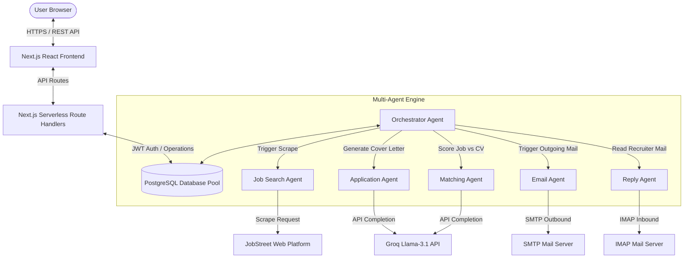
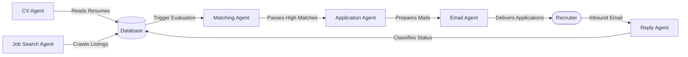
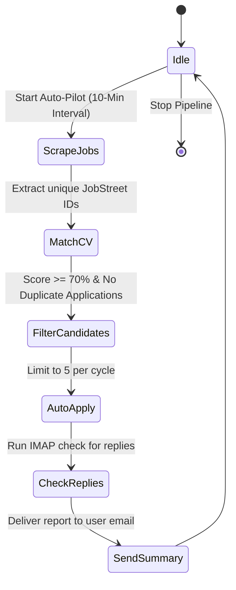
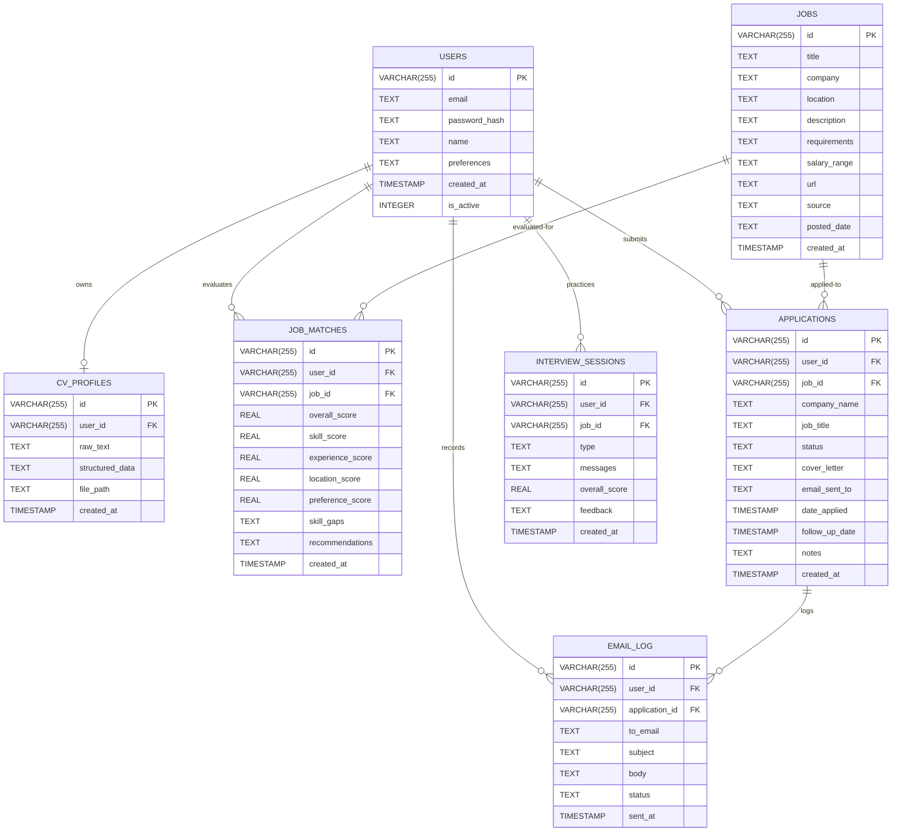

# AI Job Agent — Full System Design & Implementation Manual

An autonomous, multi-agent AI assistant that automates end-to-end job discovery, resume matching, application delivery, and email follow-ups.

---

## 3.0 System Design - XL

### 3.1 Overall System Architecture

The AI Job Agent is designed on a modular, decoupled architecture consisting of an interactive dashboard frontend, an API router controller, an asynchronous multi-agent orchestrator, and a database layer.



#### Technology Stack:
* **Frontend**: Next.js 16 (React 19), Tailwind CSS, Lucide React icons.
* **Backend**: Next.js App Router API Handlers, Node.js runtime.
* **Database**: PostgreSQL (connected via the `pg` client pool adapter).
* **AI Engine**: Groq SDK (`llama-3.1-8b-instant` model integration).
* **Network & Protocols**:
  * SMTP (via Nodemailer) for job application delivery.
  * IMAP (via ImapFlow) for incoming recruiter response tracking.

#### System Components:
1. **Interactive Dashboard**: Provides real-time metrics (Total Applications, Interviews Scheduled, Offers Received, Average Compatibility Score), status tables, and an toggle controls.
2. **Server API Controller**: Manages session states, registers users, parses PDF documents, handles manual applications, and queries stats.
3. **Multi-Agent Core**: The coordination pipeline executing search-match-apply loops.
4. **Relational Database**: Stores user details, structured CV profiles, cached job listings, scores, applications, and email log records.

#### Data Flow:
1. **CV Ingestion**: User uploads a resume $\rightarrow$ CV Agent extracts text $\rightarrow$ LLM parses structured JSON $\rightarrow$ Database saves CV record.
2. **Auto-Pilot Pipeline**: Orchestrator wakes up $\rightarrow$ Job Search Agent crawls listings $\rightarrow$ Matching Agent checks listings against CV profile $\rightarrow$ If compatibility score $\ge 70\%$, Application Agent writes cover letter $\rightarrow$ Email Agent sends application.
3. **Inbox Check**: Reply Agent checks IMAP server $\rightarrow$ Matches recruiter emails to active applications by date and company $\rightarrow$ Updates application status $\rightarrow$ Email Agent forwards summary alert to the user.

#### External Services:
* **Groq API**: Handles semantic matching, CV structuring, cover letter generation, and email reply classification.
* **SMTP / IMAP Mail Servers**: Interfaces with email endpoints to send and scan applications.
* **JobStreet**: Target platform for scraping job listings.

---

### 3.2 Multi-Agent System Design

The application uses a team of cooperative, specialized agents to automate the job search pipeline:



#### 1. CV Agent (`cv-agent.ts`)
* **Purpose**: Parse raw PDF resume files.
* **Logic**: Uses a PDF parser to extract raw textual strings. Passes the text to the Groq LLM with a system instruction to format it into a structured JSON schema mapping the candidate's skills, experience, education, and preferences.

#### 2. Job Search Agent (`job-search-agent.ts`)
* **Purpose**: Discovers job openings matching user parameters.
* **Logic**: Queries JobStreet for listings. Extracts unique numeric IDs from URLs (e.g., `/job/93301389`) to prevent duplicate listings in the database.

#### 3. Matching Agent (`matching-agent.ts`)
* **Purpose**: Evaluates candidate fit for scraped jobs.
* **Logic**: Inputs the structured CV profile and the job description to the LLM. The model evaluates matching criteria and outputs an overall match score ($0 - 100\%$), individual criteria scores, skill gaps, and recommendations.

#### 4. Application Agent (`cover-letter-agent.ts`)
* **Purpose**: Automates cover letter creation.
* **Logic**: Uses the LLM to draft a personalized cover letter matching the candidate's experience to the job requirements.

#### 5. Email Agent (`email-agent.ts`)
* **Purpose**: Manages SMTP communications.
* **Logic**: Uses Nodemailer to send application emails. Supports test redirects via `EMAIL_REDIRECT` and system notification overrides using `isSystemNotification: true`.

#### 6. Reply Agent (`reply-agent.ts`)
* **Purpose**: Monitors candidate email for recruiter updates.
* **Logic**: Searches IMAP inbox for unread messages. Matches incoming emails to applications based on the company name, job title, and dates. Classified responses (`accepted`, `rejected`, `other`) automatically update the application status in the database.

#### 7. Interview Agent (`interview-agent.ts`)
* **Purpose**: Power the AI Interview Trainer simulator.
* **Logic**: Simulates technical/HR interview questions based on the candidate's CV and the job description, evaluates responses, and provides constructive feedback.

---

### 3.3 Automation Workflow

The pipeline runs automatically when Auto-Pilot is enabled, checking and applying to jobs in cycles.



#### Automation Rules:
* **Scraper Frequency**: Runs every 10 minutes in the background when active.
* **Match Threshold**: Auto-applies only if the overall match score is $\ge 70\%$.
* **Application Cap**: Limit to 5 applications per cycle to prevent spamming.
* **Deduplication Check**: Ensures the candidate hasn't already applied to the same job ID, company name, or job title.
* **Date Guard Check**: Ignore incoming emails received before the application date.
* **Start/Stop Controls**: Users can toggle Auto-Pilot on and off from the dashboard, which writes the `is_active` state to the database and starts the background cycle.

---

### 3.4 Database and Memory Design

The application schema is modeled in PostgreSQL to handle relational constraints and cascading deletes:



* **User Profile**: Stores auth credentials, search keyword JSON arrays, and pipeline status.
* **CV Profile**: Stores extracted text and structured JSON data (skills, experience, education).
* **Job History**: Cache of scraped listings with unique JobStreet IDs.
* **Application Records**: Logs of sent applications, cover letters, notes, and statuses.
* **Interview History**: Practice session histories, scores, messages, and feedback.

---

## 4.0 System Implementation - XL

### 4.1 System Implementation

#### Development Tools:
* **Frontend Components**: Built with React Hooks (`useState`, `useEffect`, `useCallback`) and styled with glassmorphism classes. Layout wrappers enforce dark mode theme rules.
* **Backend Router**: API routing handled by Next.js serverless route handlers, running JWT validations.
* **Database Adapter**: The `pg` client manages PostgreSQL connections using a connection pool. The database schema is initialized on server startup using Next.js `instrumentation.ts`.
* **LLM Engine**: Connected to the Groq API using Llama 3 models to handle resume parsing, job matching, cover letter generation, and reply classification.
* **Scraper Engine**: Custom scrapers query job boards and extract job details.
* **Email integration**: Nodemailer manages SMTP sending, and ImapFlow parses incoming recruiter emails.

#### Main Workflows:
1. **CV Parsing**: PDF files are uploaded to `/api/cv/upload` $\rightarrow$ parsed to text $\rightarrow$ LLM extracts JSON profile $\rightarrow$ Saved to `cv_profiles`.
2. **Preference Setup**: Users set their location and job category preferences in Settings $\rightarrow$ Saved in the user's database record.
3. **Auto-Pilot Pipeline**: A server-wide loop executes `runActivePipelineCycle` for active users every 10 minutes.
4. **Scrape & Match**: Queries new jobs $\rightarrow$ Deduplicates via JobStreet ID $\rightarrow$ Scores against candidate CV using Groq.
5. **Apply & Notify**: If match score $\ge 70\%$ $\rightarrow$ Generates cover letter $\rightarrow$ Sends application email $\rightarrow$ Sends cycle summary email to the user.
6. **Dashboard**: Stats page `/api/applications/stats` runs aggregation queries to update metrics in real-time.

---

### 4.2 System Integration

* **Groq SDK Integration**: Integrated using system prompts and JSON schema enforcement to ensure structured responses:
  ```typescript
  const analysis = await askJSON<ReplyAnalysis>(prompt, systemInstruction);
  ```
* **Job Scraper Integration**: Scrapes listings and extracts unique job IDs to prevent duplicate database matches.
* **Communications Integration**: Integrates Nodemailer for SMTP delivery and ImapFlow for IMAP reply tracking. Matches recruiter emails to applications using company name, role, and application date check.
