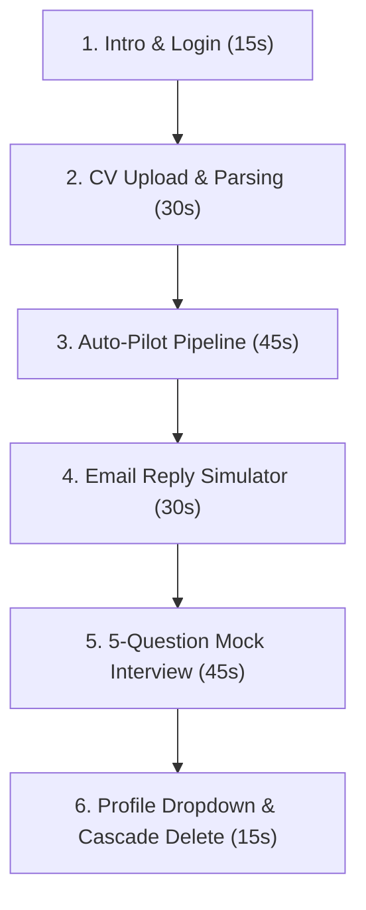

# Guide: Recording a Demo Video for AI Job Agent

A high-impact demonstration video should highlight the **seamless integration of automated scraping, auto-applying, email tracking, and AI mock prep**. Below is a structured, step-by-step recording blueprint divided into logical sections.

---

## 🎬 Suggested Video Structure (Target: ~3 Minutes)

---

## ⏱️ Step-by-Step Recording Script

### Part 1: Intro & Authentication (0:00 - 0:15)
* **What to Show**: Start on the premium Light Mode **Login** or **Register** screen. Register a new mock user account (or log in).
* **Key Visuals**: Highlight the large, crisp **HireOracle** brand logo at the top and the sleek, minimal inputs.
* **What to Say**: *"Welcome! Today, we're demonstrating the AI Job Agent—an autopilot system that scans job boards, applies matching resumes, parses recruiter replies, and prepares you for the mock interview."*

---

### Part 2: CV Profile & AI Parsing (0:15 - 0:45)
* **What to Show**: Navigate to the **CV Profile** tab. Click the file upload dropzone and upload a sample CV (PDF or DOCX). Show the progress loader and the final populated skills and experience cards.
* **Key Visuals**: Show how the raw CV text is instantaneously turned into a clean, styled profile page featuring Name, Contact Details, Skills, Experience, and Education lanes.
* **What to Say**: *"First, we upload our CV. The AI parses the file instantly, extracting contact details, career experiences, and technologies to construct our search matches profile."*

---

### Part 3: Auto-Pilot Pipeline & Job Search (0:45 - 1:30)
* **What to Show**:
  1. Go to **Settings** first to show how you configure search preferences (Salary ranges, Remote filters, SMTP, and target job keywords like *React Developer*, *Data Scientist*).
  2. Return to the **Dashboard** and toggle the **Start Auto-Pilot** switch.
* **Key Visuals**:
  * Highlight the high-contrast light blue status banner confirming: `🚀 Pipeline automation started! The agent will check, match, and batch-apply every 10 minutes...`
  * The stats counters in the card section and the job entries list.
* **What to Say**: *"In the Settings tab, we define our criteria—salary thresholds, remote preferences, and target roles. Back on the Dashboard, we activate the Auto-Pilot. The agent begins scanning job listings in the background, matching them with our skills, and drafts personalized application cover letters."*

---

### Part 4: Email Reply & Status Simulator (1:30 - 2:00)
* **What to Show**:
  1. Scroll down the **Dashboard** to the applications table.
  2. Click an active application's simulator trigger and type a typical recruiter response (e.g., *"We reviewed your application and would like to invite you for a call"*).
  3. Submit and show the application status badge automatically transition to `Interview` or `Under Review`.
* **Key Visuals**: Show the badge changing color, and show the updated timestamped logs in the notes list.
* **What to Say**: *"When companies reply, our background IMAP tracker checks the email. We'll simulate receiving a message. Notice how the AI categorizes the response, appends notes, and updates the pipeline stage to 'Interview' or 'Under Review' instantly."*

---

### Part 5: 5-Question Mock Interview Prep (2:00 - 2:45)
* **What to Show**:
  1. Navigate to the **Interview** page.
  2. Select the simulated job role, select "Technical" or "HR", and hit **Start Interview**.
  3. Type 5 answers sequentially. Highlight the inline rating score (e.g., `8/10`) and constructive tips for each reply.
  4. Submit the 5th answer to trigger the completion block. Show the locked input textbox and the **Final Interview Report** card.
* **Key Visuals**:
  * Action-by-action chat bubbles with score badges.
  * The completed emerald status pill: `✓ Interview session completed!`
  * The final card displaying the **Overall Summary** and bulleted **Actionable Recommendations**.
* **What to Say**: *"To prepare, we head to the Interview tab. The AI starts a strict 5-question mock session. For every response, we get instant scores and feedback. After answering the final question, the session locks and builds a comprehensive report highlighting overall strengths and actionable advice."*

---

### Part 6: Profile Controls & Cascade Purge (2:45 - 3:00)
* **What to Show**: Click the **ME** avatar dropdown in the header. Highlight the user details, change password form, and the **Delete Account & Records** button.
* **Key Visuals**: Click delete and watch the page route back to registration.
* **What to Say**: *"Finally, clicking the 'ME' button lets you manage security details. If you wish to wipe your footprint, a single click cascade-deletes your account and all associated jobs, chats, and records from the database. Thank you for watching!"*

---

> [!TIP]
> **Recording Tips:**
> * **Resolution**: Record in standard 1080p (1920x1080) at full-screen window width to make the slate labels readable.
> * **Transitions**: Keep a slight pause (1-2s) when clicking pages so you can easily edit or cut the video later.
> * **Theme**: The premium pastel highlights and white backdrops show up best when recorded with standard display contrast settings.
