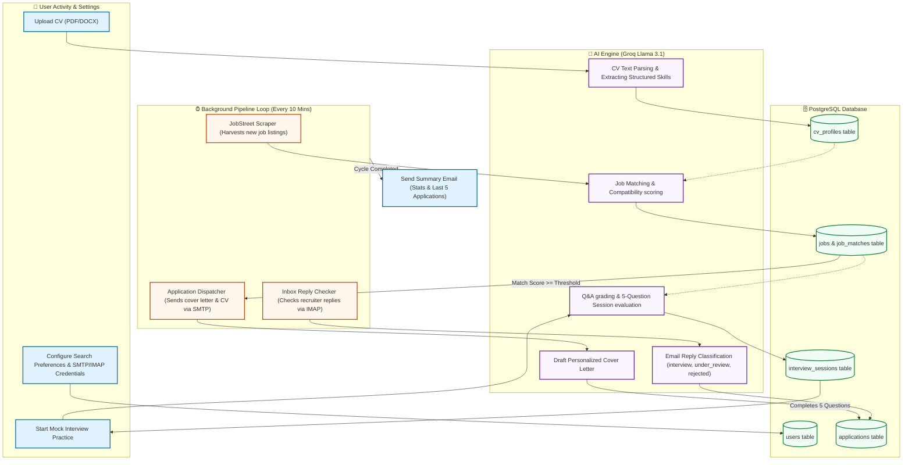

# AI Job Agent System Workflow Diagram

Below is the complete architectural and operational workflow diagram of the AI Job Agent system, mapping user actions, automated background pipelines, database models, and LLM processing layers.

---

## 📊 System Workflow Diagram

---

## 🔍 Key Operational Steps

1. **Profile Building**: The candidate uploads their CV. The **AI Parser** structures it into profile records containing skills, education, and career experience.
2. **Autonomous Scrape & Match**: The **JobStreet Scraper** extracts new listings in the background. The **AI Matcher** scores each job's compatibility against the candidate's parsed profile.
3. **Dispatch & Application**: If the score meets the matching threshold, the agent uses **SMTP** credentials to email a custom-crafted cover letter and CV to the recruiter, creating an **Application** row in PostgreSQL.
4. **Inbox Tracking**: The **Inbox Reply Checker** monitors the inbox using **IMAP**. It feeds recruiter responses to the **AI Classifier**, updating the pipeline state (`Applied` $\rightarrow$ `Under Review` $\rightarrow$ `Interview` $\rightarrow$ `Rejected`).
5. **Interview Preparation**: The user practices interactive mock interviews tailored to a specific job matching their profile. After exactly **5 rounds of Q&A**, the interface locks and outputs a final report outlining strengths and actionable recommendations.
6. **Cycle Summary**: The orchestrator sends a summary email containing all-time stats, the last 5 applications, and incoming interviews.
